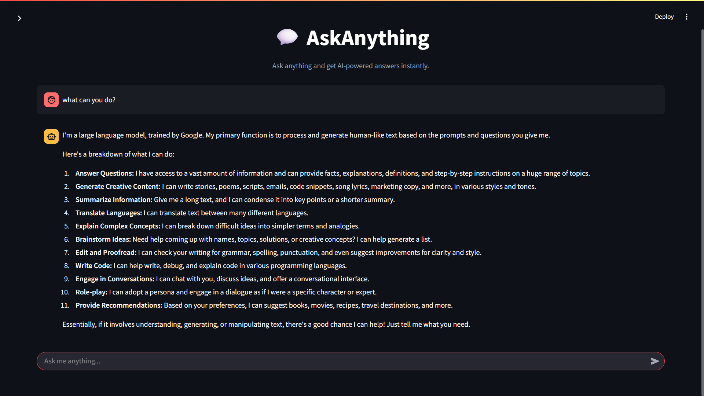
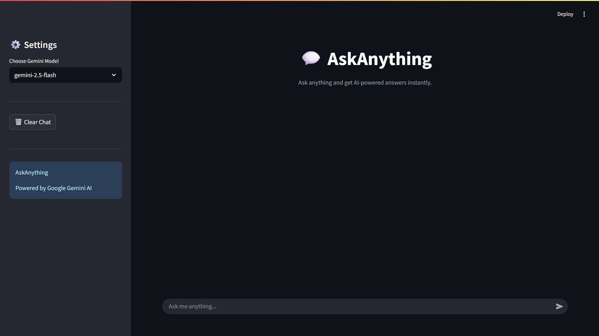

# 💬 AskAnything – AI-Powered Gemini Chat Assistant

AskAnything is a modern AI chatbot built using **Python**, **Streamlit**, and **Google Gemini AI**. It provides an intuitive and responsive chat experience where users can ask questions and receive intelligent responses in real time.

The application features a beautiful dark-themed interface, session-based chat history, Gemini model selection, and secure API key management through environment variables.

---

🌐 Live Demo

🚀 Try it here: https://ask1anything.streamlit.app/

---

## 📸 Screenshots

### 🏠 Home Screen



*Modern landing page with Gemini model selection, clean UI, and dark theme.*

---

### 💬 Chat Interface



*Interactive AI conversation with session history and real-time Gemini responses.*

---

## ✨ Features

- 🤖 Powered by Google Gemini AI
- 💬 Real-time conversational chatbot
- 📝 Session-based chat history
- ⚡ Fast AI-generated responses
- 🌙 Beautiful dark-themed interface
- ⚙️ Gemini model selection
- 🔄 Clear Chat functionality
- 🔐 Secure API key management with `.env`
- 🚨 Error handling and loading indicators
- 📱 Responsive and user-friendly design

---

## 🛠️ Tech Stack

| Technology | Purpose |
|------------|---------|
| Python | Backend Logic |
| Streamlit | Frontend & Web Framework |
| Google Gemini API | AI Response Generation |
| python-dotenv | Environment Variable Management |

---

## 📂 Project Structure

```text
AskAnything/
│
├── assets/
│   ├── home-screen.png
│   └── chat-interface.png
│
├── app.py
├── requirements.txt
├── .env
├── .gitignore
└── README.md
```

---

## 🚀 Installation & Setup

### 1. Clone the Repository

```bash
git clone https://github.com/YOUR_USERNAME/AskAnything.git
cd AskAnything
```

### 2. Create a Virtual Environment (Optional)

```bash
python -m venv venv
```

#### Activate Virtual Environment

**Windows**

```bash
venv\Scripts\activate
```

**Linux/macOS**

```bash
source venv/bin/activate
```

---

### 3. Install Dependencies

```bash
python -m pip install -r requirements.txt
```

---

### 4. Configure Environment Variables

Create a `.env` file in the project root directory:

```env
GOOGLE_API_KEY=your_google_gemini_api_key
```

Get your API key from:

https://aistudio.google.com/app/apikey

---

### 5. Run the Application

```bash
python -m streamlit run app.py
```

The application will automatically open in your browser.

---

## 🎯 How It Works

1. User enters a prompt in the chat interface.
2. The prompt is sent to the selected Gemini model.
3. Google Gemini processes the request.
4. The generated response is returned.
5. Conversation history is maintained during the session.
6. Users can clear chat history anytime using the sidebar.

---

## 🔒 Security

API keys are stored securely using environment variables and should never be committed to GitHub.

Example `.gitignore`:

```gitignore
.env
__pycache__/
*.pyc
```

⚠️ **Important:** Never upload your `.env` file or API keys to a public repository.

---

## 🌟 Future Improvements

- 📄 PDF Question Answering
- 🖼️ Image Understanding with Gemini Vision
- 🎙️ Voice Assistant Integration
- 💾 Export Chat History
- ☁️ Streamlit Cloud Deployment
- 🗄️ Database-backed Chat Storage
- 👤 User Authentication
- 🌐 Multi-language Support
- 📊 Analytics Dashboard

---

## 🤝 Contributing

Contributions, issues, and feature requests are welcome.

1. Fork the repository
2. Create a feature branch

```bash
git checkout -b feature-name
```

3. Commit your changes

```bash
git commit -m "Add new feature"
```

4. Push to your branch

```bash
git push origin feature-name
```

5. Open a Pull Request

---

## 👨‍💻 Author

### Lakshay Srivastava

Passionate about Generative AI, Full-Stack Development, and building intelligent applications using modern technologies.

---

## ⭐ Support

If you found this project useful:

⭐ Star the repository

🍴 Fork the repository

📢 Share it with others

---

### Built with ❤️ using Streamlit and Google Gemini AI
